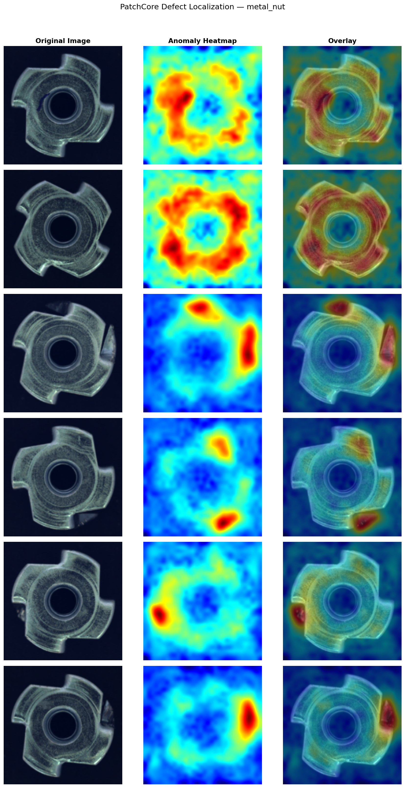
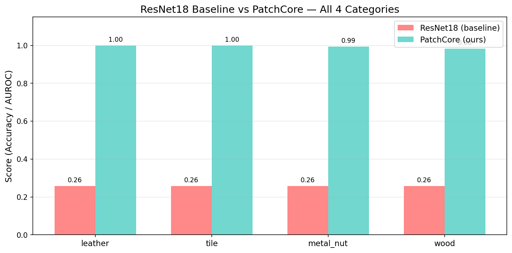

# 🔍 DefectLens — Industrial Defect Detection

> AI-powered visual inspection system built during a research internship at **CSIR-CSIO, Chandigarh**. Detects and localizes surface defects in industrial components using PatchCore anomaly detection — with **zero labeled defective training examples required**.


---

## Results

| Category | Image AUROC | Pixel AUROC |
|---|---|---|
| Leather | **1.0000** | 0.9930 |
| Tile | **0.9993** | 0.9517 |
| Metal Nut | **0.9946** | 0.9847 |
| Wood | **0.9833** | 0.9314 |
| **Average** | **0.9943** | **0.9652** |

Trained on the [MVTec AD dataset](https://www.mvtec.com/research-teaching/datasets/mvtec-ad) using PatchCore + WideResNet50-2 backbone.

---

## Defect Localization

Each inference produces an anomaly heatmap highlighting exactly where the defect is located:

**Leather** — Original · Anomaly Map · Overlay


**Metal Nut** — Original · Anomaly Map · Overlay


---

## Baseline vs PatchCore

An early ResNet18 classifier baseline failed entirely — scoring 25.8% accuracy by always predicting "good," since the dataset contains only defect-free training images. This motivated the switch to anomaly detection.



---

## Live Demo App

The **DefectLens** Streamlit app includes:
- **Live Inspection** — real PatchCore inference with animated scan sweep, anomaly heatmap, and calibrated GOOD/DEFECTIVE verdict
- **Quick Gallery** — interactive AUROC charts and pre-computed results
- **How It Works** — step-by-step pipeline breakdown
- **Session Log** — tracks all inspections run in the current session

```bash
pip install -r requirements.txt
streamlit run app/streamlit_app.py
```
### Calibration note
Detection thresholds include a 12% safety margin above the model's raw fitted threshold, prioritizing fewer false alarms over maximum sensitivity — the standard tradeoff in industrial QA systems, where a human double-check is preferable to a missed defect reaching production.
---

## How It Works

PatchCore builds a memory bank of patch-level features from defect-free training images. At inference, each patch is compared against this memory bank — patches that deviate significantly are flagged as anomalous, producing a per-pixel heatmap and an image-level anomaly score compared against a calibrated threshold.

This approach mirrors real industrial settings, where defective samples are rare but defect-free production output is abundant.

---

## Tech Stack

PyTorch · Anomalib 2.5.0 · WideResNet50-2 · OpenCV · Streamlit · Plotly · Google Colab (T4 GPU)

---

*Research internship project · CSIR-CSIO, Chandigarh · June 2026*